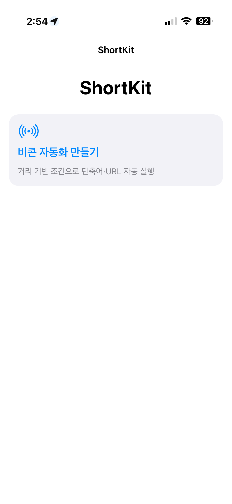
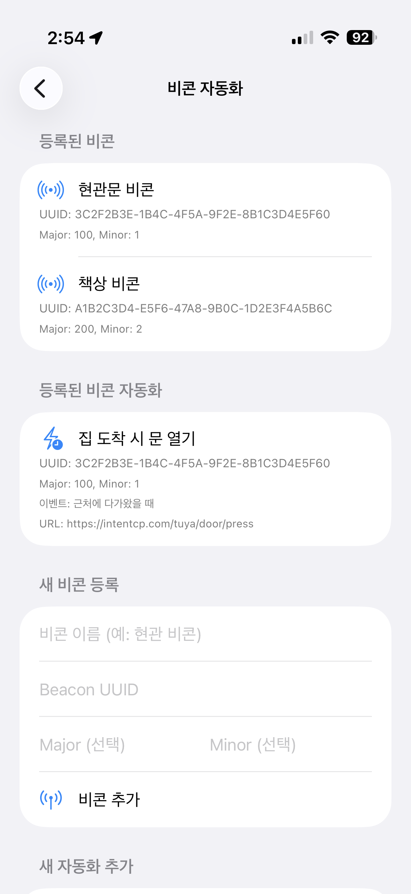

# ShortKit

ShortKit은 iBeacon 이벤트(Enter/Exit)를 트리거로 하여 사전에 설정된 **URL(Webhook / Control URL)** 을 자동 실행하는 iOS 애플리케이션입니다.  
현관 근처 접근과 같은 “정밀한 위치 기반 자동화”를 단순한 설정만으로 구성하는 것을 목표로 합니다.

---

## Screenshots

  
  

> The UUID/Major/Minor values and automation names shown in the screenshots are demo-only dummy data.

---

본 앱은 [**IntentCP**](https://github.com/jaebinsim/IntentCP) 프로젝트의 트리거 전용 컴패니언(Companion) 앱으로 설계되었습니다.

- **ShortKit (Trigger Plane)**: 물리적 거리(비콘) 기반 이벤트 감지 및 URL 호출
- **IntentCP (Control Plane)**: 호출된 URL을 수신하여 의도 분석 및 로컬 액션 실행

이 구조를 통해 “물리 이벤트 감지”와 “실제 액션 실행”을 분리하여, 위치 기반 자동화를 보다 안정적으로 구성할 수 있습니다.

다만 ShortKit의 본질은 특정 서버에 종속된 기능이 아니라, **iBeacon 이벤트를 기반으로 임의의 URL(Webhook)을 호출하는 범용 트리거 앱**입니다.  
따라서 IntentCP는 대표적인 연동 사례일 뿐이며, URL만 제공된다면 Home Assistant, IFTTT, 개인 서버(FastAPI), 사내 시스템, 로깅/모니터링 엔드포인트 등 다양한 환경에 동일한 방식으로 연결할 수 있습니다.

예를 들어 다음과 같은 용도로 확장 가능합니다.
- 현관/방 단위 자동화 트리거(조명, 에어컨, 보안 모드)
- 출입/이동 이벤트 기반 체크인 및 로그 수집(Notion/Sheets/DB)
- 특정 구역 접근 시 서버 작업 실행(PC 잠금, 작업 시작/종료, 알림 전송)
- 사내/개발 환경에서 물리 트리거 기반 배포/테스트 훅 호출

---

## Why iBeacon

현관 자동화처럼 “문 앞 수준”의 좁은 범위 트리거가 필요한 시나리오에서는 GPS/지오펜스보다 iBeacon이 유리합니다.

- **정밀한 트리거 범위**: 실내/복도 환경에서도 특정 지점 근처 이벤트(Enter/Exit)로 구성 가능
- **백그라운드 동작 적합성**: iOS Region Monitoring 기반으로 앱 비활성 상태에서도 이벤트 감지 가능
- **저전력**: BLE(Bluetooth Low Energy) 기반으로 상시 폴링 방식 대비 배터리 부담이 낮음

---

## 주요 기능

- **iBeacon 등록 및 관리**
  - UUID, Major, Minor(선택) 기반 비콘 등록
- **자동화(Trigger) 생성**
  - Enter/Exit 이벤트별 실행할 URL(현재 GET) 지정
- **실행 피드백**
  - 이벤트 감지 및 URL 호출 시 로컬 알림 제공
- **범용성**
  - IntentCP 외에도 Webhook을 지원하는 모든 서비스(Home Assistant, IFTTT, 개인 서버 등)와 연동 가능

---

## 활용 예시

- **현관 근처 접근 시 도어락 연계**
  - Enter 이벤트에서 Control URL 호출 → 서버가 조건 확인 후 개폐 수행
- **집 도착 시 홈 오토메이션**
  - 조명/에어컨/가습기 등의 프리셋 엔드포인트 호출
- **기록/로깅**
  - Enter/Exit 이벤트를 서버에서 로그로 수집(Notion/Sheets 연동 포함)

---

## Requirements & Permissions

### Requirements
- iOS 16.0+
- 비콘 송신 장치(물리 비콘 또는 비콘 송신용 앱/장치)
- 실제 iOS 기기(시뮬레이터는 비콘 감지 지원에 제약이 있음)

### Permissions
- **Location**: ‘항상 허용(Always)’ 권한 권장(백그라운드 감지 목적)
- **Notifications**: 실행 피드백 수신 목적
- **Background Modes**: `Location updates` 활성화 권장

## Roadmap

- 조건부 로직 강화
  - 근접도(Proximity: Immediate/Near/Far) 기반 조건 세분화
  - (선택) RSSI/추정거리(Accuracy) 기반 임계값 조건 지원  
    - 예: -65dBm 이상일 때만 실행 / 추정거리 1.5m 이하일 때만 실행
  - 중복 실행 방지(쿨다운/디바운스), 재시도/백오프 정책 추가

- 액션 확장
  - GET 외 POST 지원
  - 커스텀 HTTP 헤더/바디 설정
  - 다중 액션(체인) 구성

- 보안 및 안전장치(현관 자동화 권장 구성)
  - Enter 이벤트에서 즉시 개폐하지 않고 `pre-open` 상태만 서버에 전달
  - 서버가 추가 조건을 만족할 때만 “open 확정” 수행
    - 예: 스마트폰이 집 내부 Wi-Fi SSID에 연결된 경우에만 확정
    - 예: 추가 기기 인증/토큰 검증 후 확정
  - 호출 URL에 대한 API Key/Token 기반 인증 헤더 지원(클라이언트/서버 양측)

  ---
